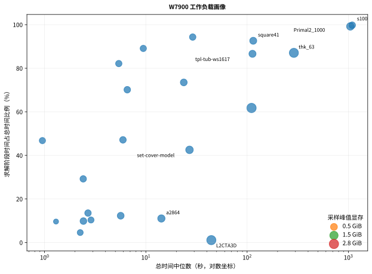
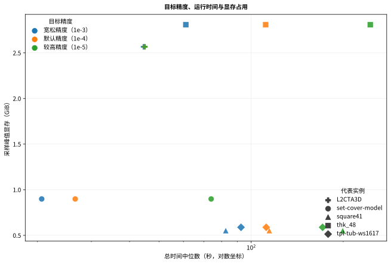

# 竞赛评审入口：基于 Radeon GPU 的 ROCm 大规模线性规划求解器迁移与证据链

> English: [COMPETITION_README.md](COMPETITION_README.md)
> 项目主页：[README.md](../README.md)
> 最终正式结果：[W7900_FINAL_RESULTS_20260729.zh-CN.md](W7900_FINAL_RESULTS_20260729.zh-CN.md)

本文把通用开源仓库中的代码、验证、性能分析和复现材料映射到竞赛评审需求。
它不把项目重新定义成一次性竞赛软件。

## 项目问题

> 如何把以 CUDA 为主要 GPU 路径的真实大规模线性规划求解器迁移到
> AMD ROCm/HIP，并用可追溯证据证明它能够构建、求解、保持可接受数值行为，
> 同时解释性能差异并约束调优风险。

项目不提出新的 PDLP 算法。核心贡献是三后端工程、CUDA-to-ROCm 迁移、
数值验证、profiling、安全调优、负向实验和最终正式证据合同。

## 贡献与最终证据

| 方向 | 贡献 | 最终证据 |
|---|---|---|
| ROCm/HIP 迁移 | 新增 AMD 后端，保留 CPU/CUDA | [迁移案例](CUDA_TO_ROCM_MIGRATION_CASE_STUDY.zh-CN.md) |
| 工程边界 | CPU、CUDA、ROCm 独立构建模式 | [后端模式](BACKEND_MODES_AND_NAMING.zh-CN.md) |
| 正式基线 | nonhard23 × 2 | 46/46 `VALIDATED_OPTIMAL` |
| 精度敏感性 | 5 例 × 3 档 × 2 次 | 30/30 `VALIDATED_OPTIMAL` |
| 资源证据 | VRAM、GPU 利用率、功耗、温度、时钟 | 每条正式运行均有采样 |
| Profiling | targeted rocprof | 历史 P10 compact 热点 + 最终 5/5 trace 验证 |
| 安全调优 | P11 接受 `CSR_ALG1` | 保留 `csr_alg2` 回退 |
| 负向实验 | P12 改变迭代轨迹 | patch 被拒绝并保留 |
| 重复验证 | P14-A1 quick6 | current 6/6 胜出且迭代数一致 |
| 最终 QC | branch、solver、harness、dataset、internal SHA | `FINAL_ANALYSIS_RELEASED` |
| 可复现性 | compact evidence、脚本、图与文档 | 普通 Linux 可检查和重画 |

## 最终 W7900 数字

| 指标 | 结果 |
|---|---:|
| 正式 solver 运行 | **76/76 验证通过** |
| nonhard23 基线 | 23 例 × 2 次 |
| 两轮总时间 | 2950.625997 s / 2950.674611 s |
| 单卡顺序吞吐均值 | **28.061611 cases/hour** |
| 总时间 CV 中位数 | **0.377%** |
| CV < 2% | **22/23** |
| 两轮迭代数一致 | **23/23** |
| Top-3 总时间占比 | **82.22%** |
| precision 正式矩阵 | 30/30 |
| profile | 5/5 `PASS` |
| 最大实际误差/目标精度 | **0.998079** |

## 核心性能解释

```text
总时间
  ≈ 读取、解析、初始化与收尾
  + 单迭代执行成本 × 迭代次数
```

最终工作负载画像表明：

- `s100`、`Primal2_1000`、`thk_63` 等属于长迭代、求解阶段主导；
- `L2CTA3D` 属于超大输入但低迭代、加载与初始化主导；
- 收紧目标精度的总时间代价从约 1.01× 到 4.01×，具有实例依赖性；
- 静态规模与显存关系强，但静态相关不能替代收敛分析。





## Profiling 与调优证据链

1. P10 compact profiling 定位 rocSPARSE CSR SpMV 为多个代表实例的重要
   GPU kernel group，并发现 copy 与 launch 开销；
2. P11 对库算法做受控比较，接受 `HIPSPARSE_SPMV_CSR_ALG1`；
3. P12 因迭代数变化拒绝执行层 patch；
4. P14-A1 用重复实验确认 current 收益和迭代一致性；
5. 最终 session2 再验证五个 profile 的采集和 trace 完整性。

这条证据链表明，性能优化不能脱离 termination、feasibility、gap 和迭代轨迹。

## 推荐评审顺序

1. [项目主页](../README.md)
2. [最终正式结果](W7900_FINAL_RESULTS_20260729.zh-CN.md)
3. [CUDA-to-ROCm 迁移案例](CUDA_TO_ROCM_MIGRATION_CASE_STUDY.zh-CN.md)
4. [W7900 性能行为](W7900_PERFORMANCE_BEHAVIOR.zh-CN.md)
5. [Profiling 记录](ROCM_PROFILING_NOTES.zh-CN.md)
6. [验证语义](VALIDATION.zh-CN.md)
7. [最终复现指南](FINAL_REPRODUCTION_GUIDE.zh-CN.md)
8. [最终 compact evidence](../validation/final_w7900_20260729/README.zh-CN.md)
9. [评分项对照](COMPETITION_SCORECARD.zh-CN.md)

## 贡献边界

可以主张：

- 完成真实科学计算求解器的 CUDA-to-ROCm/HIP 迁移；
- 建立 CPU、CUDA、ROCm 三后端工程边界；
- 完成 76/76 正式 solver 运行的验证闭环；
- 建立精度—性能—资源与工作负载画像；
- 用正向、负向和重复实验形成安全调优方法；
- 提供可检查、可重画、可追踪来源的 compact evidence。

不能主张：

- 提出了新的 PDLP 算法；
- W7900 在所有实例上超过 CUDA；
- 8 卡是单个 LP 的分布式求解；
- 五例精度实验代表所有 LP；
- 静态相关证明因果；
- Docker 骨架完整复现正式数字；
- 已认证所有 AMD GPU 架构。
