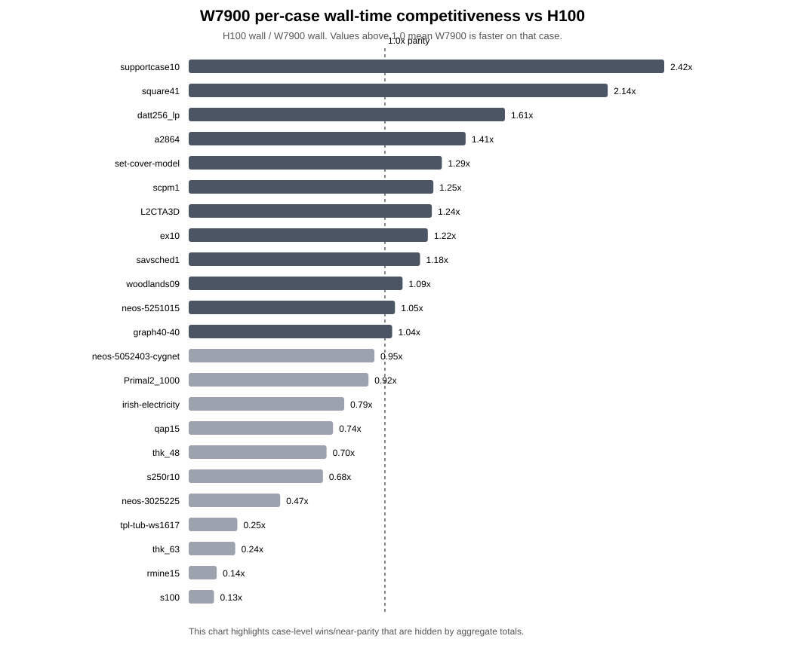
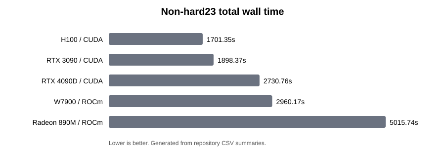
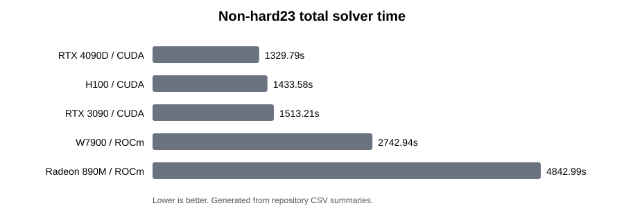
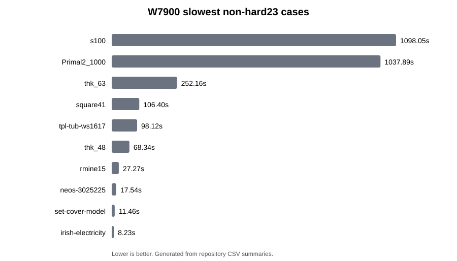
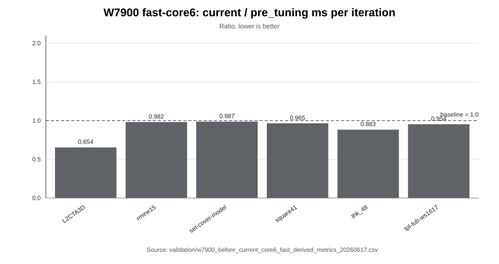
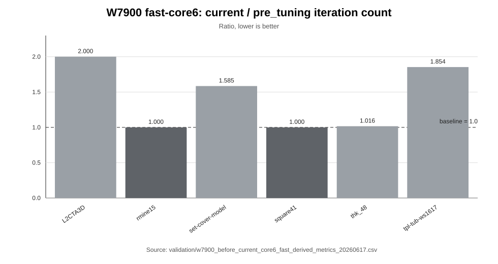

# W7900 当前状态与文档修订锚点

> English: [W7900_CURRENT_STATUS.md](W7900_CURRENT_STATUS.md)

本文是 W7900 / `gfx1100` 的当前状态锚点，用来替换仓库中较旧的 first-port-only 描述。

## 当前状态

W7900 分支已经不再只是 `afiro` smoke 实验。目前已经具备：

- W7900 first-port build 与 smoke validation。
- W7900 Netlib 27-case baseline。
- W7900 large-MPS `initial17_safe` baseline。
- W7900 large-MPS `non-hard23` baseline。
- 剩余 large-MPS hard cases 单独拆出分析：`dlr1.mps`、`Dual2_5000.mps`、`fhnw-binschedule1.mps`。

## Large-MPS non-hard23 汇总

| Metric | Value |
|---|---|
| Cases | 23 |
| Termination | 23/23 OPTIMAL |
| Source groups | initial17_safe: 17, near_optimal2_1800s: 2, watchlist6_900s: 4 |
| W7900 total wall time | 2960.171 s |
| W7900 total solve time | 2742.940 s |

<!-- W7900_COMPETITIVE_CHARTS_20260614_BEGIN -->
## Per-case 竞争力亮点

non-hard23 aggregate totals 有分析价值，但 W7900 最有说服力的故事是 per-case：W7900 在部分 large-MPS case 上可以接近甚至超过 H100 的 wall time，而慢 case 更适合从收敛行为解释。



完整竞争力和 case 分类讨论见 [W7900 性能行为分析](W7900_PERFORMANCE_BEHAVIOR.zh-CN.md)。
<!-- W7900_COMPETITIVE_CHARTS_20260614_END -->

## 同 23 个 case 的跨设备参考

| Device | Wall time sum | Solve time sum | Wall vs W7900 | Solve vs W7900 |
|---|---|---|---|---|
| H100 / CUDA | 1701.350 | 1433.577 | 0.57x | 0.52x |
| RTX 3090 / CUDA | 1898.370 | 1513.214 | 0.64x | 0.55x |
| RTX 4090D / CUDA | 2730.760 | 1329.789 | 0.92x | 0.48x |
| W7900 / ROCm | 2960.171 | 2742.940 | 1.00x | 1.00x |
| Radeon 890M / ROCm | 5015.740 | 4842.987 | 1.69x | 1.77x |





## W7900 最慢 non-hard cases

| Case | Source group | nIter | Wall time | Solve time | Rel gap |
|---|---|---|---|---|---|
| s100 | near_optimal2_1800s | 675400 | 1100.650 | 1098.047 | 9.986063828e-05 |
| Primal2_1000 | near_optimal2_1800s | 1203440 | 1046.038 | 1037.885 | 9.830367122e-05 |
| thk_63 | watchlist6_900s | 73960 | 288.564 | 252.165 | 4.756861046e-05 |
| square41 | watchlist6_900s | 128360 | 115.159 | 106.404 | 9.463231177e-05 |
| tpl-tub-ws1617 | watchlist6_900s | 82600 | 112.519 | 98.123 | 4.13613801e-05 |
| thk_48 | watchlist6_900s | 17720 | 110.058 | 68.336 | 5.213466659e-05 |
| rmine15 | initial17_safe | 15000 | 28.928 | 27.271 | 4.180620533e-05 |
| neos-3025225 | initial17_safe | 6080 | 23.590 | 17.538 | 7.825931282e-05 |
| set-cover-model | initial17_safe | 7480 | 26.926 | 11.464 | 9.3551367e-06 |
| irish-electricity | initial17_safe | 53680 | 9.285 | 8.229 | 1.62842043e-06 |



## 理论价值与应用价值

cuPDLP/PDLP 类求解器面向大规模线性规划问题，其核心操作是稀疏矩阵向量乘法，因此适合 GPU 加速。但总耗时同时取决于单次迭代开销和收敛路径。

对于项目报告，这一阶段的 W7900 工作能够体现：

- 科学计算求解器从 CUDA 到 ROCm 的可复现迁移路径。
- 大显存 AMD 工作站 GPU 面向 large LP/MPS 工作负载的验证流程。
- 基于数据的 safe、slow-but-solvable、hard-case 分层方法。
- 后续 ROCm profiling 与 tuning 的调优前 baseline。

## 为什么 W7900 有些 case 快、有些 case 慢

W7900 具备较高 FP32 峰值、较大显存和较高显存带宽，因此当 case 有足够的稀疏矩阵向量乘工作量并且收敛稳定时，能够发挥硬件优势。但 PDLP 总耗时不只是硬件吞吐问题：

```text
total time ≈ per-iteration cost × number of iterations
```

对于 hard LP instance，稀疏归约、浮点顺序、adaptive restart 时机、step-size 演化、residual/gap 轨迹上的微小差异，都可能改变迭代路径。这可以解释为什么 W7900 在部分 large case 上表现较好，但在 `s100`、`Primal2_1000` 或 hard3 上表现不一定理想。

<!-- W7900_PERFORMANCE_BEHAVIOR_20260614_BEGIN -->
## 相关性能行为分析

关于为什么 W7900 在部分 large-MPS case 上快、在另一些 case 上慢，详见：

- [W7900 performance behavior analysis](W7900_PERFORMANCE_BEHAVIOR.md)
- [W7900 性能行为分析](W7900_PERFORMANCE_BEHAVIOR.zh-CN.md)
<!-- W7900_PERFORMANCE_BEHAVIOR_20260614_END -->

<!-- W7900_ROCM_PROFILING_PLAN_20260614_BEGIN -->
<!-- W7900_OPTIMIZATION_BASELINES_20260614_BEGIN -->
## 优化基线口径说明

当前 W7900 non-hard23 结果不是未优化 first-port baseline，而是继承 890M/gfx1150 调优成果后的 current ROCm/HIP 工程分支在 W7900 / `gfx1100` 上的验证。

详见 [W7900 优化基线说明](W7900_OPTIMIZATION_BASELINES.zh-CN.md)。
<!-- W7900_OPTIMIZATION_BASELINES_20260614_END -->

## ROCm profiling 与调优完成状态

原 profiling 计划已执行并由 P10/P11/P12 证据链取代。当前不再把 starter profiling 或 W7900-specific tuning 写成 pending blocker。

最终入口见 [W7900 ROCm profiling 计划](W7900_ROCM_PROFILING_PLAN.zh-CN.md)、[P11 SpMV tuning summary](../validation/w7900_p11_spmv_tuning_summary_20260617.zh-CN.md) 和 [P12 rejected experiment note](../validation/w7900_p12_spmv_buffer_alg_consistency_negative_20260617.zh-CN.md)。
<!-- W7900_ROCM_PROFILING_PLAN_20260614_END -->

## 下一步

P2--P9 的 W7900 验证、profiling、批处理吞吐和派生指标分析已经提交。
下一阶段应从“补证据”转向 W7900-specific tuning triage：

1. 基于 fast-core6 派生指标，优先分析 `L2CTA3D`、`set-cover-model`、
   `tpl-tub-ws1617` 为什么在 current 下虽然 ms/iter 降低，但迭代数增加。
2. 后续 profiling 不盲目扩大 benchmark 矩阵，而是选择代表性 case：
   - 正向执行效率样本：`thk_48`
   - 迭代数稳定样本：`square41`
   - 收敛迭代数回退样本：`L2CTA3D`、`set-cover-model`、`tpl-tub-ws1617`
3. 优先寻找“保留 current 单迭代执行收益，同时恢复接近 pre_tuning 收敛行为”的改动。
4. 继续关注 copy reduction 和 rocSPARSE/SpMV profiling，但不要在没有明确
   数值验证的情况下改动 residual、restart、termination 或 scaling 逻辑。
5. 8-card fast8 批处理吞吐结果单独作为 independent-MPS throughput 亮点保留，
   不写成“单个 MPS 由 8 张 GPU 联合求解”。
## 最新 W7900 实验状态 / 2026-06-16

W7900 / `gfx1100` 实验集已更新四组 compact summary：

- [rocprof starter3](../validation/w7900_rocprof_starter3_summary_20260616.zh-CN.md)
- [hard3 probe2 600s](../validation/w7900_large_mps_hard3_probe2_600s_summary_20260616.zh-CN.md)
- [before/current fast-core6](../validation/w7900_before_current_core6_fast_summary_20260616.zh-CN.md)
- [8-card fast8 batch throughput](../validation/w7900_8card_batch_fast8_summary_20260616.zh-CN.md)

8-card fast8 实验在 8 卡并发和单 GPU 顺序两种模式下均达到 8/8 `OPTIMAL`，其中 8 卡并发 makespan 为 146s，单 GPU 顺序 makespan 为 558s。
<!-- W7900_LATEST_EXPERIMENTS_20260616_END -->

<!-- W7900_LATEST_FIGURES_20260616_BEGIN -->
## 最新 W7900 图表 / 2026-06-16

最新 W7900 图表索引如下：

- [W7900 最新实验图表](../validation/w7900_latest_experiment_figures_20260616.zh-CN.md)

最适合作为材料亮点的是 8-card fast8 批处理吞吐图：8 个独立 MPS 任务在 8 张 W7900 上并发完成时间为 146s，而单张 W7900 顺序运行需要 558s。
<!-- W7900_LATEST_FIGURES_20260616_END -->

## before/current 派生分析 / 2026-06-17

最新 fast-core6 派生指标把总求解时间拆分为迭代次数和单迭代执行耗时：

- [派生指标中文汇总](../validation/w7900_before_current_core6_fast_derived_metrics_20260617.zh-CN.md)
- [派生指标 CSV](../validation/w7900_before_current_core6_fast_derived_metrics_20260617.csv)
- [英文汇总](../validation/w7900_before_current_core6_fast_derived_metrics_20260617.md)





该派生结果对后续调优解释很重要：current 在 6 个 fast-core6 case 上
均降低了单迭代执行耗时，但由于部分 case 迭代次数增加，总 solve time
仍呈 mixed pattern。因此后续 W7900-specific tuning 应同时优化执行效率
与收敛行为。

## P10 targeted rocprof 汇总 / 2026-06-17

P10 基于 P9 派生指标选择 5 个代表 case 做 targeted rocprofv3 profiling：

- 正向执行效率样本：`thk_48`
- 迭代数稳定样本：`square41`
- 收敛迭代数回退样本：`L2CTA3D`、`set-cover-model`、
  `tpl-tub-ws1617`

链接：

- [P10 中文汇总](../validation/w7900_p10_current_targeted_rocprof_20260617_summary.zh-CN.md)
- [P10 runtime CSV](../validation/w7900_p10_current_targeted_rocprof_20260617_runtime.csv)
- [P10 kernel top CSV](../validation/w7900_p10_current_targeted_rocprof_20260617_kernel_top.csv)
- [P10 HIP API top CSV](../validation/w7900_p10_current_targeted_rocprof_20260617_hip_api_top.csv)
- [P10 memory copy top CSV](../validation/w7900_p10_current_targeted_rocprof_20260617_memory_copy_top.csv)

5 个 targeted case 在 current 下均成功完成。compact trace 显示，
rocSPARSE CSR SpMV kernel 在多个 case 中是主要 GPU kernel 热点；
`hipMemcpy`、`hipMemcpyAsync` 和 `hipLaunchKernel` 也是较长 case 上突出的
HIP API 成本。这说明后续调优应重点关注 SpMV 行为、kernel launch 数量
和 host-device copy reduction，同时不要盲目改动 solver 数值逻辑。

## P11 runtime 调用点清单 / 2026-06-17

P11 在正式调优 patch 前，先补充源码级调用点清单。

链接：

- [P11 runtime 调用点清单](../validation/w7900_p11_runtime_callsite_inventory_20260617.zh-CN.md)
- [P11 inventory CSV](../validation/w7900_p11_runtime_callsite_inventory_20260617.csv)
- [P11 英文汇总](../validation/w7900_p11_runtime_callsite_inventory_20260617.md)

该清单把 P10 trace 热点和源码位置联系起来。下一步优化 patch 应只属于
execution-layer，不应盲目改动 residual、restart、termination、scaling 或
浮点更新顺序。

## P11 第一轮优化候选 / 2026-06-17

P11 first-patch candidate analysis 在 P10 profiling 和 P11 调用点清单
之后，对下一步安全调优方向进行排序。

链接：

- [P11 第一轮优化候选中文汇总](../validation/w7900_p11_first_patch_candidates_20260617.zh-CN.md)
- [P11 first patch candidates CSV](../validation/w7900_p11_first_patch_candidates_20260617.csv)
- [P11 英文汇总](../validation/w7900_p11_first_patch_candidates_20260617.md)

当前建议是不要盲目删除 `hipMemcpy`。第一个真正代码改动应是 opt-in
实验，优先考虑 SpMV algorithm-selection/profiling 开关，或一个窄范围、
有保护的 scalar-copy experiment，并用 fast-core6 和 P10 targeted cases 明确验证。

## P11 SpMV algorithm switch smoke / 2026-06-17

第一个真正的 P11 tuning patch 增加了 opt-in HIP SpMV algorithm switch。
默认行为仍然保持 `HIPSPARSE_SPMV_CSR_ALG2`。

链接：

- [P11 SpMV algorithm switch smoke 中文汇总](../validation/w7900_p11_spmv_alg_switch_smoke_20260617_summary.zh-CN.md)
- [P11 SpMV algorithm switch smoke CSV](../validation/w7900_p11_spmv_alg_switch_smoke_20260617.csv)
- [P11 英文 smoke 汇总](../validation/w7900_p11_spmv_alg_switch_smoke_20260617_summary.md)

初始 `set-cover-model` smoke 在默认 `csr_alg2`、opt-in `default` 和
opt-in `csr_alg1` 三种模式下均通过。下一步是在 P10 五个 targeted case
上做三模式 sweep。

## P11 SpMV algorithm sweep / 2026-06-17

P11 已补充 opt-in HIP SpMV algorithm switch 的五 case、三 mode sweep。

链接：

- [P11 SpMV algorithm sweep 中文汇总](../validation/w7900_p11_spmv_alg_sweep_20260617_summary.zh-CN.md)
- [P11 SpMV algorithm sweep CSV](../validation/w7900_p11_spmv_alg_sweep_20260617.csv)
- [P11 英文 sweep 汇总](../validation/w7900_p11_spmv_alg_sweep_20260617_summary.md)

sweep 确认 `csr_alg2`、`env_default` 和 `csr_alg1` 在 5 个 targeted case
上都保持 solver status 和迭代数一致。单次 sweep 中，`csr_alg1` 在多数长
case 上略快，但幅度很小。下一步应选择重复 sweep 估计噪声，或对最有代表性
的 `csr_alg1` vs 默认 `csr_alg2` 做 rocprofv3 对比。

## P11 default SpMV ALG1 smoke / 2026-06-17

P11 现在将 W7900 当前调优默认 HIP SpMV algorithm 设为
`HIPSPARSE_SPMV_CSR_ALG1`，同时保留显式回退路径：

- 回退旧默认：`CUPDLP_HIP_SPMV_ALG=csr_alg2`
- hipSPARSE default 实验：`CUPDLP_HIP_SPMV_ALG=default`

链接：

- [P11 default SpMV ALG1 smoke 中文汇总](../validation/w7900_p11_default_spmv_alg1_smoke_20260617_summary.zh-CN.md)
- [P11 default SpMV ALG1 smoke CSV](../validation/w7900_p11_default_spmv_alg1_smoke_20260617.csv)
- [P11 英文 smoke 汇总](../validation/w7900_p11_default_spmv_alg1_smoke_20260617_summary.md)

这是基于 P11 五 case sweep 的策略更新。应描述为当前 W7900 默认调优选择，
不应写成最终跨平台性能结论。

## P11 SpMV tuning final note / 2026-06-17

P11 完成第一条 W7900-specific tuning 闭环：

- P10 targeted profiling 发现 rocSPARSE CSR SpMV 是所选 case 上的主要
  GPU kernel 热点。
- P11 增加了 opt-in HIP SpMV algorithm switch。
- P11 smoke validation 确认 `csr_alg2`、`default` 和 `csr_alg1` 三种模式
  在 `set-cover-model` 上均可运行。
- P11 五 case sweep 确认三种模式在 targeted cases 上保持 solver status 和
  迭代数一致。
- 当前 W7900 默认策略已切换为 `HIPSPARSE_SPMV_CSR_ALG1`。
- 旧默认仍可通过 `CUPDLP_HIP_SPMV_ALG=csr_alg2` 恢复。

链接：

- [P11 SpMV tuning 中文总结](../validation/w7900_p11_spmv_tuning_summary_20260617.zh-CN.md)
- [P11 英文 tuning summary](../validation/w7900_p11_spmv_tuning_summary_20260617.md)

这使 P11 成为一个保守的策略更新闭环。该结果应表述为 W7900 当前默认调优
选择，不应表述为最终全局性能结论。

## P12 negative finding：拒绝 SpMV buffer algorithm consistency patch / 2026-06-17

P11 之后额外测试了一个低风险执行层候选：让
`hipsparseSpMV_bufferSize()` 使用与 `cupdlp_hip_spmv_alg()` 选择结果一致的
algorithm。

该实验被拒绝，因为 `set-cover-model` 虽然仍能成功求解，但迭代数从 `7480`
变为 `7600`。这说明即使是 SpMV buffer/algorithm 一致性改动，也可能影响
solver 轨迹。源码 patch 已撤回，未提交。

链接：

- [P12 negative finding 中文汇总](../validation/w7900_p12_spmv_buffer_alg_consistency_negative_20260617.zh-CN.md)
- [P12 英文 negative finding summary](../validation/w7900_p12_spmv_buffer_alg_consistency_negative_20260617.md)
