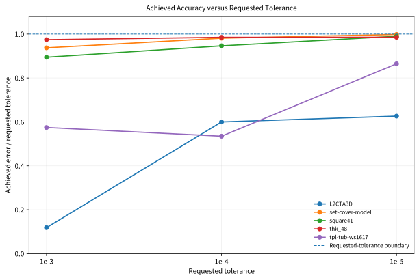

# Final W7900 Formal Results (2026-07-29)

> 中文：[W7900_FINAL_RESULTS_20260729.zh-CN.md](W7900_FINAL_RESULTS_20260729.zh-CN.md)
> Compact evidence:
> [validation/final_w7900_20260729](../validation/final_w7900_20260729/README.md)

This page is the authoritative result summary for the final W7900 formal
experiment phase. Earlier dated reports remain immutable historical evidence.

## Frozen identity

| Item | Value |
|---|---|
| Formal branch | `rocm-w7900-gfx1100` |
| Frozen solver source | `735764807d8698ff30811d1a6fcc45d4a3fd4817` |
| Formal harness | `b5b9a6ffc1a041a48a0e051568d0134a3822556c` |
| Window 1 archive SHA256 | `d2ce13091072a7c40c2c89bdd988e94c2fca36772da38e0af87de6332e7cd94a` |
| Window 2 archive SHA256 | `7f8fbcd45591f4dbe0899d18df76329b1f9a17ff433b6dcd3c06d743aaead0db` |
| Final analysis handoff SHA256 | `361904acc594e807517556d03e6f8520ea889bc491149aa50ae99ffc79478593` |

The QC contract verifies that `CMakeLists.txt`, `cmake/`, `cupdlp/`, and
`interface/` remain identical to the frozen solver baseline.

## Formal coverage

| Stage | Matrix | Result |
|---|---|---:|
| Window 1 | 23 nonhard23 cases × 2 repeats | 46/46 `VALIDATED_OPTIMAL` |
| Window 2 precision | 5 cases × 3 tolerances × 2 repeats | 30/30 `VALIDATED_OPTIMAL` |
| Window 2 profiling | 5 targeted cases | 5/5 `PASS` |
| Static structure | 23 nonhard23 cases | 23/23 validation `PASS` |
| Total formal solver records | — | **76/76** |

Both formal archives passed source and internal checksums, dataset identity,
formal branch/harness/solver identity, complete matrix checks, resource
coverage, duplicate-identity checks, and final QC.

## Baseline and throughput

| Repeat | Total time | Solver time | Single-card throughput |
|---:|---:|---:|---:|
| 1 | 2950.625997 s | 2733.855858 s | 28.061842 cases/hour |
| 2 | 2950.674611 s | 2729.993157 s | 28.061379 cases/hour |
| Mean | **2950.650304 s** | **2731.924507 s** | **28.061611 cases/hour** |

“Single-card throughput” means one W7900 processing independent MPS cases
sequentially. It is not one LP distributed across multiple GPUs.

Median total-time CV is **0.377%**; 22/23 cases
are below 2%, and all 23 cases preserve identical iteration counts across the
two repeats.

The three longest cases account for **82.22%** of complete baseline
total time; the first six account for **93.69%**.

## Workload profile

The final evidence separates iteration/compute-dominated cases from
load/initialization-dominated cases. `L2CTA3D` is the clearest example of a
very large matrix with few iterations and a small solver-stage share.

## Tolerance, performance, and resources

Tightening from `1e-3` to `1e-5` changes:

- total time by
  **1.01×–
  4.01×**;
- solver time by
  **2.02×–
  11.03×**;
- iterations by
  **2.02×–
  11.58×**.

For a given case, sampled peak VRAM changes little across tolerances while
runtime can change substantially. The dominant precision cost is therefore
iteration-path behavior rather than additional memory allocation.

All 30 precision runs have their maximum reported relative error at or below
the requested tolerance. The largest observed ratio is
**0.998079**.

This conclusion is limited to the five targeted cases.

## Static structure and VRAM

Exploratory Spearman associations include:

- `matrix_nnz` versus sampled peak VRAM: `rho=0.882`;
- `file_bytes` versus sampled peak VRAM: `rho=0.887`;
- `file_bytes` versus total time: `rho=0.718`;
- `file_bytes` versus non-solver overhead: `rho=0.974`;
- `columns` versus per-iteration time: `rho=0.609`.

These are exploratory associations over 23 cases, not causal claims.
Coefficient dynamic range is not a condition number.

## Profiling

All five final session2 profiles are `DONE`, exit code 0, validation `PASS`,
with five trace CSV files and one kernel-trace CSV per case. Detailed hotspot
interpretation remains grounded in the already committed P10 compact evidence:
rocSPARSE CSR SpMV is a major kernel group, while copy and launch overhead also
matter. Raw traces remain outside Git.

## Claim boundaries

Supported:

- 76/76 formal solver runs validated;
- mean sequential single-card throughput of
  **28.061611 cases/hour**;
- a strongly long-tailed baseline;
- case-dependent tolerance cost;
- static-size association with VRAM and non-solver overhead;
- a complete profiling, QC, archival, and analysis-release chain.

Not supported:

- a new PDLP algorithm;
- one-LP multi-GPU performance;
- generalizing the five tolerance cases to all LPs;
- causal interpretations of static correlations;
- certification of every AMD GPU architecture;
- treating the Docker skeleton as the source of formal W7900 measurements.
