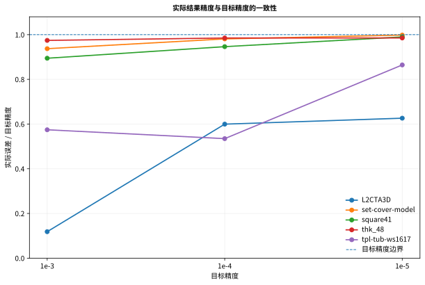

# W7900 正式实验最终结果（2026-07-29）

> English: [W7900_FINAL_RESULTS_20260729.md](W7900_FINAL_RESULTS_20260729.md)
> Compact evidence:
> [validation/final_w7900_20260729](../validation/final_w7900_20260729/README.zh-CN.md)

本文是本项目最后一轮 W7900 正式实验的结果页。它替代早期单轮
large-MPS 结果作为当前主证据，但不会删除或改写 `validation/` 中的历史
日期化报告。

## 1. 冻结身份

| 项目 | 值 |
|---|---|
| 正式分支 | `rocm-w7900-gfx1100` |
| 冻结 solver 源码 | `735764807d8698ff30811d1a6fcc45d4a3fd4817` |
| 正式 harness | `b5b9a6ffc1a041a48a0e051568d0134a3822556c` |
| Window 1 archive SHA256 | `d2ce13091072a7c40c2c89bdd988e94c2fca36772da38e0af87de6332e7cd94a` |
| Window 2 archive SHA256 | `7f8fbcd45591f4dbe0899d18df76329b1f9a17ff433b6dcd3c06d743aaead0db` |
| 最终分析交接包 SHA256 | `361904acc594e807517556d03e6f8520ea889bc491149aa50ae99ffc79478593` |

正式 harness 与冻结 solver 的边界由 QC 验证：`CMakeLists.txt`、`cmake/`、
`cupdlp/`、`interface/` 保持与冻结基线一致。

## 2. 正式证据覆盖

| 阶段 | 矩阵 | 结果 |
|---|---|---:|
| Window 1 | 23 个 nonhard23 × 2 次 | 46/46 `VALIDATED_OPTIMAL` |
| Window 2 precision | 5 例 × 3 档 × 2 次 | 30/30 `VALIDATED_OPTIMAL` |
| Window 2 profile | 5 个 targeted cases | 5/5 `PASS` |
| 静态结构 | 23 个 nonhard23 | 23/23 validation `PASS` |
| 合计正式 solver 记录 | — | **76/76** |

两个正式归档均通过：

- source SHA 和包内 SHA；
- 数据集 SHA；
- 正式分支、harness 和 solver 身份；
- 无 timeout、无 error、无重复身份；
- 每条 solver 记录有资源采样；
- 完整矩阵与 QC。

## 3. nonhard23 基线与吞吐

| Repeat | 总时间 | 求解时间 | 单卡吞吐 |
|---:|---:|---:|---:|
| 1 | 2950.625997 s | 2733.855858 s | 28.061842 cases/hour |
| 2 | 2950.674611 s | 2729.993157 s | 28.061379 cases/hour |
| 均值 | **2950.650304 s** | **2731.924507 s** | **28.061611 cases/hour** |

“单卡吞吐”表示一张 W7900 顺序处理独立 MPS 实例，不是单个 LP 的多 GPU
并行。


### 重复性

- 23 例总时间 CV 中位数：**0.377%**；
- **22/23** 例 CV 低于 2%；
- **23/23** 例两轮迭代数完全一致；
- `s250r10` 是唯一明显波动项，总时间 CV 约 7.57%。每例只有两次重复，
  不应进一步推断其统计分布。


### 长尾

`s100`、`Primal2_1000` 和
`thk_63` 合计占总时间的
**82.22%**；前六例占 **93.69%**。吞吐优化应优先
覆盖长尾实例。

## 4. 工作负载画像

工作负载画像使用：

- 横轴：总时间中位数；
- 纵轴：求解阶段时间占总时间比例；
- 气泡大小：采样峰值显存。


该图揭示两类主要机制：

1. **迭代/计算主导。** `s100`、`Primal2_1000`、`thk_63`、
   `square41` 等求解阶段占比较高；
2. **读取/初始化主导。** `L2CTA3D` 包含巨大矩阵，但迭代数很少，求解阶段
   只占总时间很小部分。

因此，后续优化必须区分“每次迭代贵”“迭代次数多”和“加载/初始化贵”。

## 5. 目标精度、性能与资源

五个代表实例为：

```text
L2CTA3D
set-cover-model
square41
thk_48
tpl-tub-ws1617
```

三档目标精度为 `1e-3`、`1e-4`、`1e-5`，每个组合重复两次。


从 `1e-3` 收紧到 `1e-5`：

- 总时间倍率：
  **1.01×–
  4.01×**；
- 求解时间倍率：
  **2.02×–
  11.03×**；
- 迭代次数倍率：
  **2.02×–
  11.58×**。

资源图显示，同一实例的采样峰值显存随目标精度变化很小，而总时间变化可能
很大；主要成本来自迭代路径，而不是额外显存分配。


30 条原始 precision 记录的三个报告相对误差指标最大值都不高于目标精度。
最接近边界的一条：

```text
case=set-cover-model
tolerance=1e-5
repeat=1
max(error) / tolerance = 0.998079
```



该结论只覆盖五个 targeted cases，不能外推到全部 nonhard23。

## 6. 静态结构与显存

23 例探索性 Spearman 分析中：

- `matrix_nnz` 与采样峰值显存：`ρ=0.882`；
- `file_bytes` 与采样峰值显存：`ρ=0.887`；
- `file_bytes` 与总时间：`ρ=0.718`；
- `file_bytes` 与非求解开销：`ρ=0.974`；
- `columns` 与单迭代时间：`ρ=0.609`。


这些是当前 23 例上的探索性关联，不是因果结论。系数动态范围也不能被描述
为条件数。

## 7. Profiling

最终 session2 中五个 targeted profile 全部：

```text
runtime_status=DONE
exit_code=0
profile_validation_status=PASS
trace_csv_count=5
kernel_trace_count=1
```

这证明最终 profiling 采集链和 trace 完整性通过。具体 kernel/API 热点结论
仍引用仓库中已有的 P10 compact evidence：

- rocSPARSE CSR SpMV 是多个代表 case 的主要 GPU kernel 热点；
- `hipMemcpy`、`hipMemcpyAsync` 和 launch 开销也需要关注；
- P11 接受 `CSR_ALG1` 默认策略；
- P12 因迭代轨迹改变而拒绝 patch。

最终 compact 包不提交 raw traces，也不从 trace 计数虚构新的热点占比。

## 8. 允许使用的结论

可以主张：

- 正式 W7900 证据中 76/76 条 solver 运行验证通过；
- nonhard23 两轮单卡顺序吞吐均值约
  **28.061611 cases/hour**；
- 基线耗时呈长尾，前三例贡献 **82.22%**；
- 精度成本具有显著实例依赖性；
- 静态规模能解释显存需求和部分非求解开销；
- profiling、验证、归档和分析发布链完整。

不能主张：

- 提出了新的 PDLP 算法；
- 单卡吞吐是单个 LP 的多 GPU 性能；
- precision 五例代表所有 LP；
- 静态相关证明因果；
- 当前实现已经认证所有 AMD GPU；
- Docker 骨架替代真实 W7900 复现。

## 9. Compact 文件

见
[validation/final_w7900_20260729/README.zh-CN.md](../validation/final_w7900_20260729/README.zh-CN.md)。
