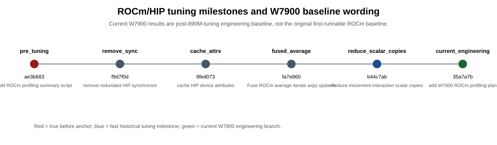

# W7900 优化基线说明

> English: [W7900_OPTIMIZATION_BASELINES.md](W7900_OPTIMIZATION_BASELINES.md)

本文修正 W7900 / `gfx1100` 当前结果的 baseline 口径。

当前 W7900 large-MPS `non-hard23` 结果**不是**未优化 first-port baseline。它是 current ROCm/HIP 工程分支在 W7900 上的验证结果，而该分支已经继承了此前 Radeon 890M / `gfx1150` 的调优成果。

## 必须采用的表述

后续报告中建议这样写：

```text
The W7900 non-hard23 baseline is the current post-890M-tuning engineering baseline.
It is not the original first-runnable ROCm baseline.
```

中文表述：

```text
当前 W7900 non-hard23 结果是继承 890M/gfx1150 调优成果后的 current engineering baseline，
不是最初只跑通、未调优的 ROCm baseline。
```

## Milestone 时间线



| Milestone | Commit | 作用 | 解释 |
|---|---|---|---|
| pre_tuning | ae3b683 | Add ROCm profiling summary script | true first-runnable / pre-tuning anchor |
| remove_sync | f9d7f0d | remove redundant HIP synchronize | first synchronization cleanup |
| cache_attrs | 8fed073 | cache HIP device attributes | helper-level overhead cleanup |
| fused_average | fa7e860 | Fuse ROCm average iterate axpy updates | average iterate update fusion |
| reduce_scalar_copies | b44c7ab | Reduce movement interaction scalar copies | fast historical tuning milestone |
| current_engineering | 35a7a7b | add W7900 ROCm profiling plan | current post-890M-tuning engineering branch |

## 现有 tuning history 证据

已有 tuning history 已经说明：`pre_tuning` 是 `ae3b683`，`reduce_scalar_copies` 是 `b44c7ab`，current branch 是保留 CPU/CUDA/ROCm 三模态兼容的工程 baseline。它还记录了 current 相对 `pre_tuning` 在 6-case quick set 上有提升，而 `reduce_scalar_copies` 是多数 quick-set case 上观察到的最快 milestone。

因此，当前 W7900 数据应表述为 **post-tuning engineering validation on W7900**，而不是 **before-tuning W7900 data**。

## 后续 before/after 策略

| 角色 | 版本 | 目的 |
|---|---|---|
| Before | `pre_tuning` / `ae3b683` | 真正 first-runnable / pre-tuning ROCm anchor |
| Current | `rocm-w7900-gfx1100` current HEAD | 当前 post-890M-tuning W7900 engineering baseline |
| After | future W7900-specific tuning branch | 最终 W7900-specific optimized result |

## 建议第一组 before/after 子集

| Case | 原因 |
|---|---|
| set-cover-model.mps | fast representative；分析 overhead / kernel dispatch |
| square41.mps | W7900 competitive case |
| s100.mps | slow-but-solvable；迭代次数敏感 |
| Primal2_1000.mps | 900s near-optimal，1800s 内 OPTIMAL |
| thk_48.mps | 中大型代表 case |
| tpl-tub-ws1617.mps | 适合跨设备比较的 large representative |

先跑这个 core6 子集，不要一开始就重跑完整 non-hard23。完整 large-MPS non-hard23 rerun 应保留给真正 pre-tuning anchor、最终 W7900-specific optimized branch，或重大 solver/kernel 改动后。

## 文档口径策略

- 不要把 current W7900 non-hard23 称为“未优化”。
- 使用 `ae3b683` 作为真正 before anchor。
- 使用 current 作为 engineering baseline。
- 使用 `reduce_scalar_copies` 作为历史最快参考点。
- hard3 在收敛轨迹证据完成前继续单独分组。
