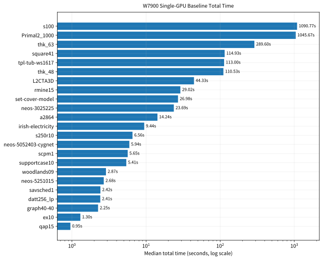
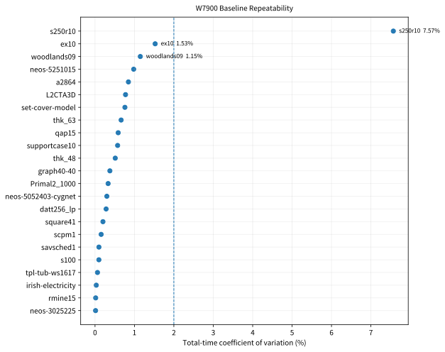
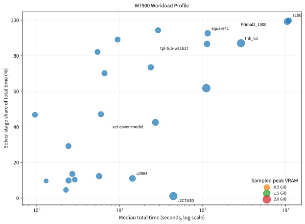
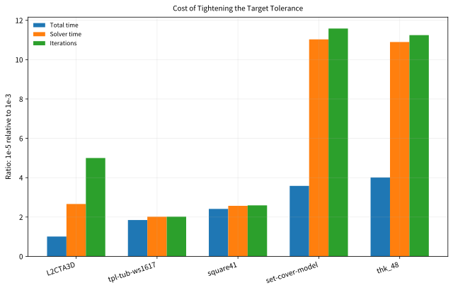
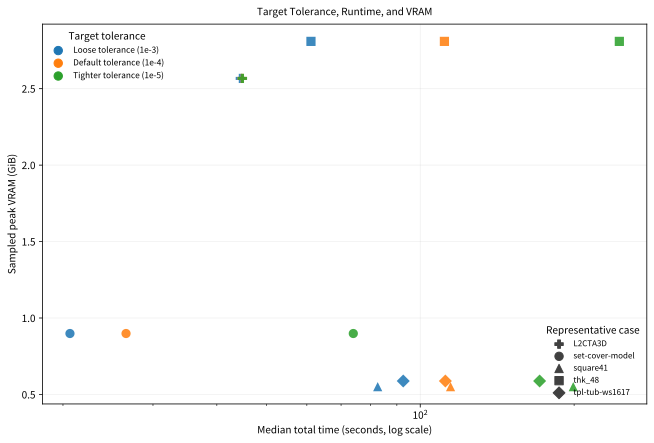
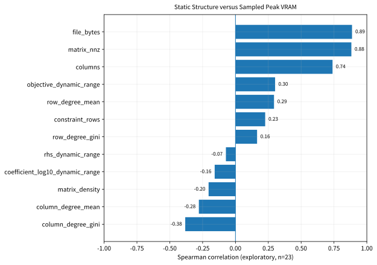

# W7900 Performance Behavior

> 中文：[W7900_PERFORMANCE_BEHAVIOR.zh-CN.md](W7900_PERFORMANCE_BEHAVIOR.zh-CN.md)
> Final data: [W7900_FINAL_RESULTS_20260729.md](W7900_FINAL_RESULTS_20260729.md)

This document interprets the final formal W7900 evidence without generalizing
one result into a claim that one hardware class is universally best for LP.

## Scope

- 23 nonhard23 cases, two complete repeats;
- five representative cases, three target tolerances, two repeats;
- VRAM, utilization, power, temperature, and clock sampling;
- static structure features for 23 MPS files;
- five validated targeted profiles;
- committed P10 compact hotspot tables for detailed kernel/API interpretation.

## Total-time model

```text
total time
  = input parsing, structure construction, initialization, finalization
  + per-iteration execution cost × iteration count
```

The model explains why a larger matrix may mostly increase initialization and
memory, while a convergence-sensitive case may be dominated by iterations.

## Long tail and repeatability

`s100`, `Primal2_1000`, and `thk_63` account for
**82.22%** of complete total time; the first six account for
**93.69%**.



Median total-time CV is **0.377%**; 22/23 cases
are below 2%, and all cases preserve identical iteration counts across repeats.



## Workload profile



Iteration/compute-dominated cases include `s100`, `Primal2_1000`, `thk_63`,
`square41`, and `tpl-tub-ws1617`. `L2CTA3D` is the clearest
load/initialization-dominated case: a very large matrix, few iterations, and a
small solver-stage share.

## Tolerance cost



Tightening from `1e-3` to `1e-5` changes total time by
**1.01×–
4.01×**. The cost is strongly
case-dependent:

- `L2CTA3D`: iteration growth is mostly hidden by initialization cost;
- `set-cover-model` and `thk_48`: the workload shifts toward solver-dominated;
- `square41` and `tpl-tub-ws1617`: total time follows solver time and
  iterations more directly.

## Resources



For each case, sampled peak VRAM is nearly constant across the three tolerances.
The precision cost is iteration/time behavior, not additional memory allocation.

## Static associations



Exploratory Spearman associations include:

| Association | rho |
|---|---:|
| `file_bytes` vs sampled peak VRAM | 0.887 |
| `matrix_nnz` vs sampled peak VRAM | 0.882 |
| `file_bytes` vs non-solver overhead | 0.974 |
| `file_bytes` vs total time | 0.718 |
| `columns` vs per-iteration time | 0.609 |

These explain memory demand and part of the loading cost; they do not establish
causation or determine convergence. A numerical-scale proxy is not a condition
number.

## Profiling interpretation

P10 compact evidence identifies rocSPARSE CSR SpMV as a major GPU kernel group,
with copy and launch overhead also visible. P11 accepted a controlled library
algorithm policy. P12 was rejected because it changed the iteration trajectory.

Final session2 adds a 5/5 profile-collection and trace-integrity validation; it
does not invent new hotspot percentages from file counts.

## Actionable conclusions

1. Throughput work should prioritize the few long-tail cases.
2. Iteration-dominated cases require joint per-iteration and convergence
   analysis.
3. Load-dominated cases require parsing, structure-construction, and data
   preparation work.
4. Every execution-layer change must preserve status, feasibility, gap, and
   acceptable iteration behavior.
5. No additional W7900 tuning belongs in this release without a new,
   pre-registered measurement question.
