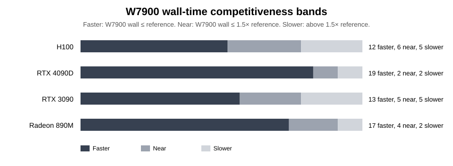
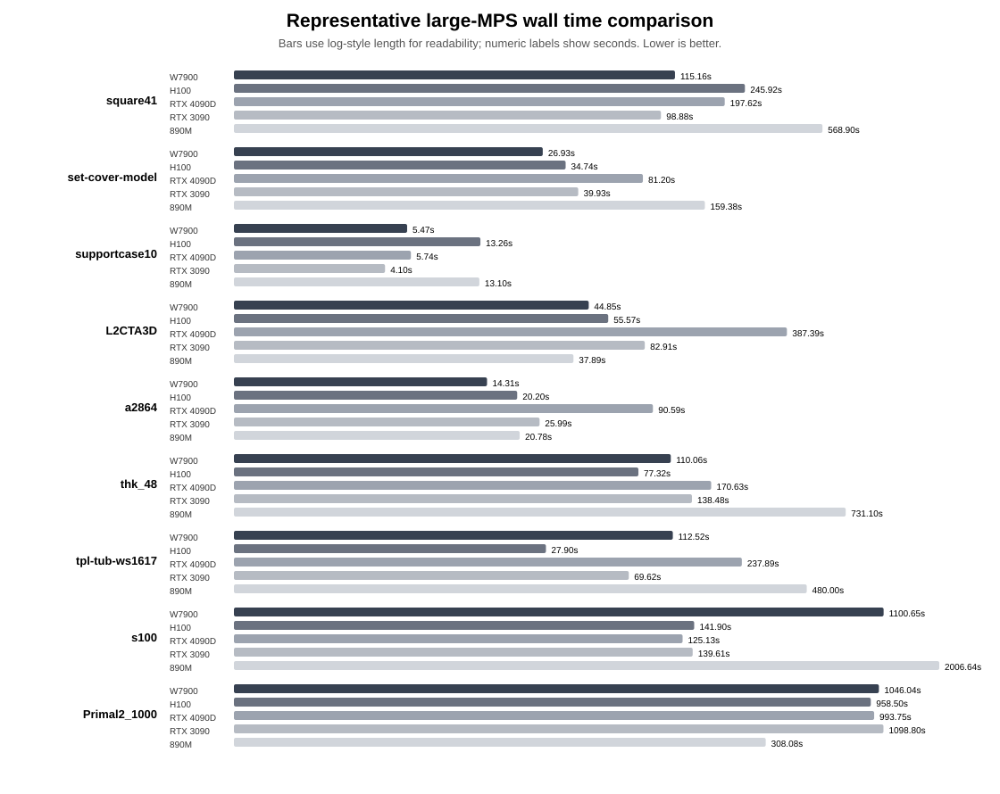
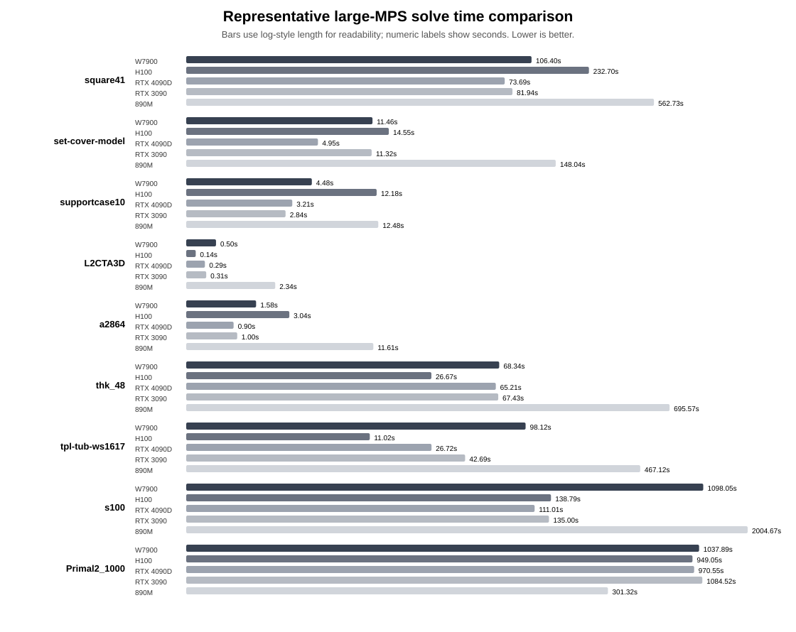
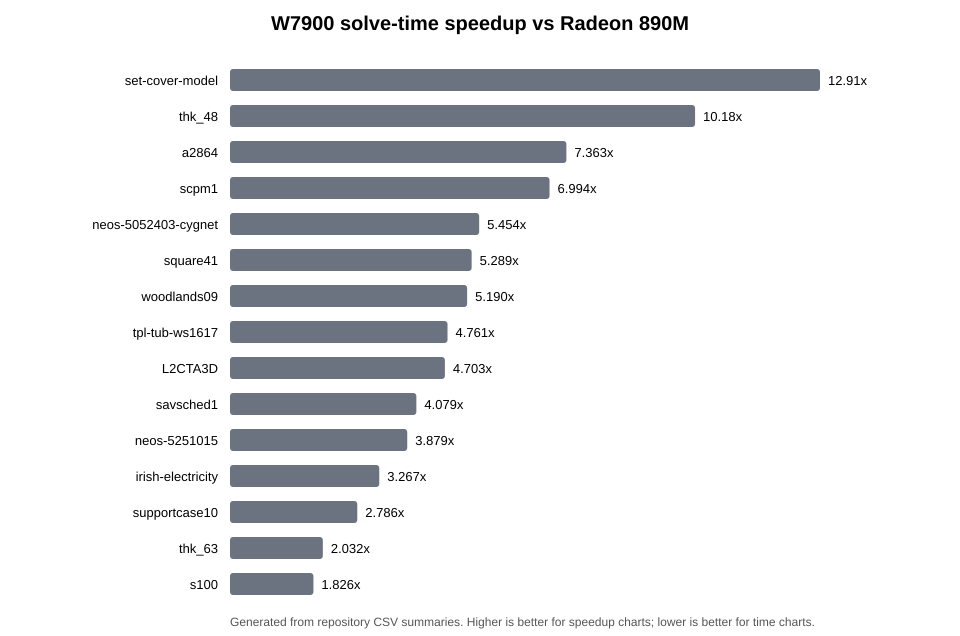
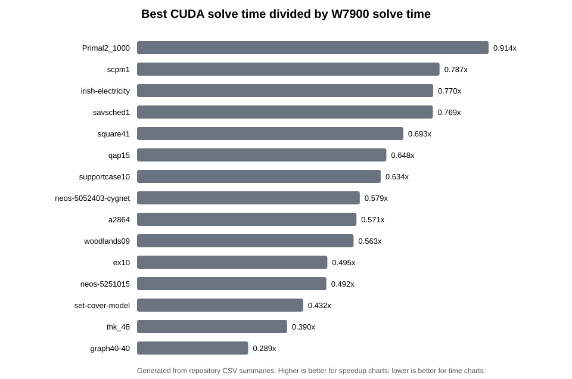
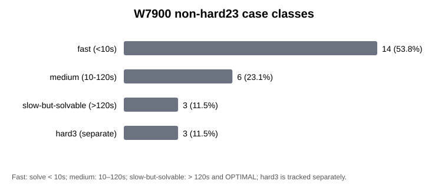

# W7900 performance behavior analysis

> 中文: [W7900_PERFORMANCE_BEHAVIOR.zh-CN.md](W7900_PERFORMANCE_BEHAVIOR.zh-CN.md)

This document explains the current W7900 / `gfx1100` performance behavior beyond the raw benchmark tables. It is intended to support later competition reports and ROCm profiling/tuning.

## What this analysis adds

The current W7900 evidence is not only that the code runs. The branch now has a reproducible 23-case non-hard large-MPS baseline, plus a hard3 split for difficult convergence behavior.

This analysis adds three points:

1. theoretical value: why PDLP-style LP solvers are suitable for GPU acceleration;
2. application value: why W7900 is relevant for large LP/MPS workloads;
3. performance interpretation: why some cases are fast, while others are slow or hard.

## Hardware and solver interpretation

W7900 is attractive for large LP/MPS workloads because it combines high FP32 throughput with 48GB GDDR6 memory, a 384-bit memory interface, 864GB/s peak memory bandwidth, and ECC support. These properties are useful when a solver repeatedly touches large sparse matrices and dense vectors.

However, PDLP total time should not be interpreted as pure GPU throughput:

```text
total time ≈ per-iteration cost × number of iterations
```

The per-iteration cost is related to sparse matrix-vector products, vector operations, reductions, and data movement. The iteration count is controlled by the numerical path: residuals, duality gap, step-size evolution, scaling, restarts, and problem conditioning.

## Non-hard23 result summary

| Metric | Value |
|---|---|
| Cases | 23 |
| Termination | 23/23 OPTIMAL |
| Total wall time | 2960.171 s |
| Total solve time | 2742.940 s |
| Total DeviceMatVecProdTime | 10.176 s |

<!-- W7900_COMPETITIVE_CHARTS_20260614_BEGIN -->
## W7900 competitiveness against H100 and CUDA references

The earlier aggregate solve-time chart is useful for bottleneck analysis, but it can hide the fact that W7900 is already competitive on many individual large-MPS cases. The charts below therefore use per-case wall time to show where W7900 matches or exceeds high-end references.

### W7900 vs H100 per-case wall-time ratio

Values above 1.0 mean W7900 is faster than H100 on that case.

| Case | W7900 wall | H100 wall | H100/W7900 |
|---|---|---|---|
| supportcase10 | 5.47 | 13.26 | 2.42x |
| square41 | 115.16 | 245.92 | 2.14x |
| datt256_lp | 2.49 | 4.02 | 1.61x |
| a2864 | 14.31 | 20.20 | 1.41x |
| set-cover-model | 26.93 | 34.74 | 1.29x |
| scpm1 | 5.67 | 7.07 | 1.25x |
| L2CTA3D | 44.85 | 55.57 | 1.24x |
| ex10 | 1.34 | 1.63 | 1.22x |
| savsched1 | 2.51 | 2.96 | 1.18x |
| woodlands09 | 2.97 | 3.24 | 1.09x |
| neos-5251015 | 2.67 | 2.81 | 1.05x |
| graph40-40 | 2.27 | 2.35 | 1.04x |


### Competitiveness bands

| Reference | W7900 faster | Near within 1.5x | Slower above 1.5x |
|---|---|---|---|
| H100 | 12 | 6 | 5 |
| RTX 4090D | 19 | 2 | 2 |
| RTX 3090 | 13 | 5 | 5 |
| Radeon 890M | 17 | 4 | 2 |



### Representative case comparison

This chart deliberately mixes cases where W7900 is strong and cases where it is slow-but-solvable. This is a better competition narrative than only showing aggregate totals, because it separates hardware competitiveness from convergence-sensitive cases.




<!-- W7900_COMPETITIVE_CHARTS_20260614_END -->

## W7900 vs 890M speedup

The following table and chart focus on solve time, which is closer to solver computation than end-to-end wall time.

| Case | 890M solve | W7900 solve | Speedup | Source group |
|---|---|---|---|---|
| set-cover-model | 148.037 | 11.464 | 12.91x | initial17_safe |
| thk_48 | 695.568 | 68.336 | 10.18x | watchlist6_900s |
| a2864 | 11.609 | 1.577 | 7.363x | initial17_safe |
| scpm1 | 4.944 | 0.707 | 6.994x | initial17_safe |
| neos-5052403-cygnet | 15.138 | 2.776 | 5.454x | initial17_safe |
| square41 | 562.727 | 106.404 | 5.289x | watchlist6_900s |
| woodlands09 | 1.590 | 0.306 | 5.190x | initial17_safe |
| tpl-tub-ws1617 | 467.122 | 98.123 | 4.761x | watchlist6_900s |
| L2CTA3D | 2.339 | 0.497 | 4.703x | initial17_safe |
| savsched1 | 0.972 | 0.238 | 4.079x | initial17_safe |
| neos-5251015 | 1.408 | 0.363 | 3.879x | initial17_safe |
| irish-electricity | 26.884 | 8.229 | 3.267x | initial17_safe |



## W7900 relative to best CUDA reference

Values above 1 mean W7900 is faster than the best CUDA reference on that case; values below 1 mean the best CUDA reference is faster.



## Case classes



| Case | Class | nIter | W7900 solve time | Rel gap |
|---|---|---|---|---|
| s100 | slow-but-solvable (>120s) | 675400 | 1098.047 | 9.986063828e-05 |
| Primal2_1000 | slow-but-solvable (>120s) | 1203440 | 1037.885 | 9.830367122e-05 |
| thk_63 | slow-but-solvable (>120s) | 73960 | 252.165 | 4.756861046e-05 |
| square41 | medium (10-120s) | 128360 | 106.404 | 9.463231177e-05 |
| tpl-tub-ws1617 | medium (10-120s) | 82600 | 98.123 | 4.13613801e-05 |
| thk_48 | medium (10-120s) | 17720 | 68.336 | 5.213466659e-05 |
| rmine15 | medium (10-120s) | 15000 | 27.271 | 4.180620533e-05 |
| neos-3025225 | medium (10-120s) | 6080 | 17.538 | 7.825931282e-05 |
| set-cover-model | medium (10-120s) | 7480 | 11.464 | 9.3551367e-06 |
| irish-electricity | fast (<10s) | 53680 | 8.229 | 1.62842043e-06 |
| s250r10 | fast (<10s) | 5240 | 5.121 | 5.357990561e-05 |
| supportcase10 | fast (<10s) | 23800 | 4.481 | 9.776586066e-05 |
| neos-5052403-cygnet | fast (<10s) | 8640 | 2.776 | 9.375217334e-05 |
| a2864 | fast (<10s) | 1400 | 1.577 | 2.844014065e-05 |
| datt256_lp | fast (<10s) | 520 | 0.730 | 5.77976796e-05 |
| scpm1 | fast (<10s) | 1320 | 0.707 | 9.490131535e-05 |
| L2CTA3D | fast (<10s) | 80 | 0.497 | 1.005417564e-05 |
| qap15 | fast (<10s) | 2840 | 0.449 | 4.56259611e-06 |
| neos-5251015 | fast (<10s) | 800 | 0.363 | 5.393595963e-05 |
| woodlands09 | fast (<10s) | 800 | 0.306 | 7.699777596e-05 |
| savsched1 | fast (<10s) | 520 | 0.238 | 7.879146734e-05 |
| ex10 | fast (<10s) | 280 | 0.127 | 4.524774349e-05 |
| graph40-40 | fast (<10s) | 80 | 0.105 | 3.326118142e-05 |

## What W7900 appears to be good at

Current data suggests that W7900 is most suitable for cases with:

- enough scale to amortize HIP setup, file parsing, matrix transfer, and launch overhead;
- stable convergence behavior, so the iteration count does not dominate;
- high sparse matrix-vector and vector-operation work, where memory bandwidth and parallelism matter;
- large memory footprints where 48GB VRAM and ECC support are valuable.

## Why some cases are slow

A slow W7900 result does not always imply a slow GPU. It can happen when:

- the LP instance needs many PDLP iterations;
- the gap trajectory stalls near the tolerance;
- adaptive restart or step-size behavior differs across hardware/backend paths;
- reductions or sparse operations expose ROCm/gfx1100 kernel inefficiencies;
- fixed overhead dominates tiny or very short cases.

## Tuning implication

The next ROCm tuning stage should not only optimize kernels. It should also record numerical trajectory evidence:

- per-case `nIter`;
- `DeviceMatVecProdTime`;
- residuals and duality gap;
- HIP/kernel/reduction profile;
- before/after changes on the same case list.

Hard3 should stay separate until its convergence trajectory is documented.
