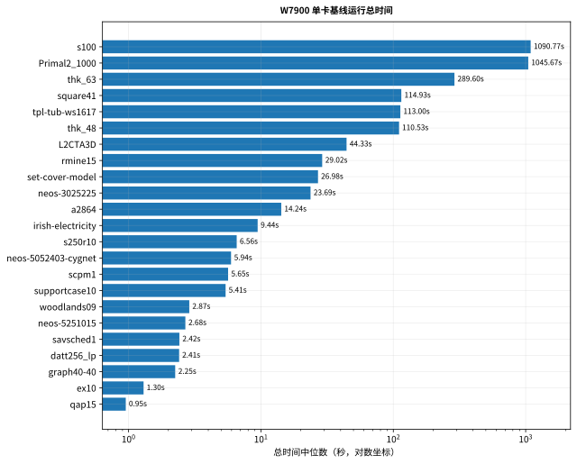
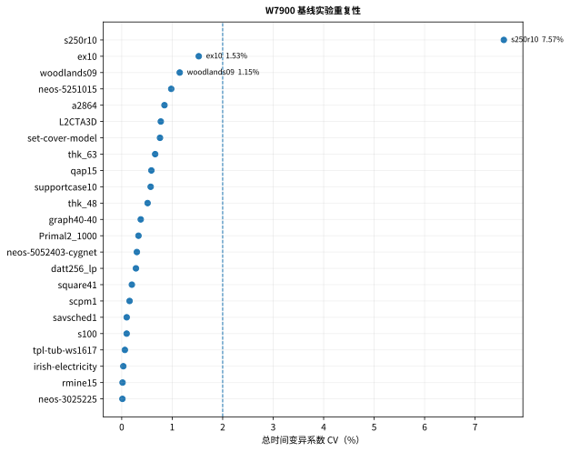
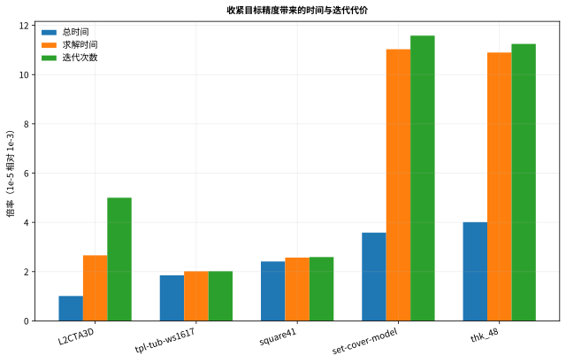
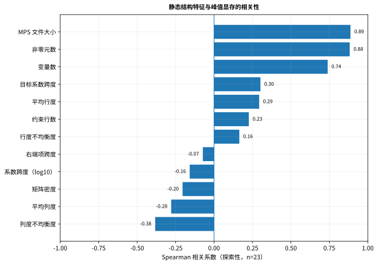

# W7900 性能行为分析

> English: [W7900_PERFORMANCE_BEHAVIOR.md](W7900_PERFORMANCE_BEHAVIOR.md)
> 最终数据：[W7900_FINAL_RESULTS_20260729.zh-CN.md](W7900_FINAL_RESULTS_20260729.zh-CN.md)

本文解释最终正式 W7900 数据中的性能机制。它不把单个数字推广成“某种硬件
天然适合所有 LP”。

## 分析范围

- 23 个 nonhard23，完整重复两次；
- 五个代表实例，三档目标精度，重复两次；
- 资源采样：VRAM、GPU 利用率、功耗、温度、时钟；
- 23 个 MPS 的静态结构特征；
- 五个 targeted profiling 的完整性验证；
- P10 已提交 compact hotspot 表作为具体 kernel/API 解释来源。

## 总时间模型

```text
总时间
  = 文件读取、解析、数据结构建立、初始化和收尾
  + 单迭代执行成本 × 迭代次数
```

因此：

- 更大的矩阵可能主要增加加载和显存；
- 更多迭代可能主导总时间；
- 更快的 kernel 不一定减少迭代次数；
- 执行层改变也可能改变浮点轨迹和收敛路径。

## 长尾

前三例 `s100`、`Primal2_1000`、`thk_63` 占完整总时间的
**82.22%**，前六例占 **93.69%**。对批处理吞吐而言，
优化少数长尾实例比平均处理所有 case 更重要。



## 重复性

正式基线两轮总时间分别为 2950.625997 s 和 2950.674611 s。23 例总时间
CV 中位数为 **0.377%**，22/23 低于 2%，
所有实例迭代数在两轮间一致。



这支持把差异解释为工作负载行为，而不是大范围测量漂移。`s250r10` 的局部
波动仍应单独保留。

## 工作负载画像


### 迭代/计算主导

典型实例包括：

- `s100`
- `Primal2_1000`
- `thk_63`
- `square41`
- `tpl-tub-ws1617`

这些实例的求解阶段占总时间比例高，优化重点应放在 SpMV、向量操作、
reduction、launch 和每迭代成本，同时严密检查迭代轨迹。

### 加载/初始化主导

`L2CTA3D` 具有巨大矩阵，但只需很少迭代。其总时间主要来自求解器主循环
之外。对这类实例，仅优化 PDHG kernel 很难显著改善端到端时间，应关注：

- MPS 读取与解析；
- 稀疏结构建立；
- CPU 到 GPU 的数据准备；
- 固定初始化和收尾成本。

## 目标精度成本



从 `1e-3` 收紧到 `1e-5`，总时间变化范围是
**1.01×–
4.01×**。这不是统一成本：

- `L2CTA3D` 的迭代数增加，但端到端时间几乎不变，因为初始化占主导；
- `set-cover-model` 和 `thk_48` 随精度收紧由固定开销主导转向求解主导；
- `square41`、`tpl-tub-ws1617` 的总时间更直接跟随迭代和求解时间。

## 资源行为


同一实例的采样峰值显存跨三档精度基本稳定：

- `L2CTA3D` 约 2.57 GiB；
- `thk_48` 约 2.81 GiB；
- `set-cover-model` 约 0.90 GiB；
- `square41` 约 0.55 GiB；
- `tpl-tub-ws1617` 约 0.59 GiB。

因此本轮精度成本主要表现为迭代和时间，不是额外显存。

## 静态结构关联



主要探索性 Spearman 关联：

| 关系 | ρ |
|---|---:|
| `file_bytes` ↔ 峰值显存 | 0.887 |
| `matrix_nnz` ↔ 峰值显存 | 0.882 |
| `file_bytes` ↔ 非求解开销 | 0.974 |
| `file_bytes` ↔ 总时间 | 0.718 |
| `columns` ↔ 单迭代时间 | 0.609 |

结论是“规模特征能解释显存和部分加载成本”，而不是“静态特征决定收敛”。
数值尺度 proxy 也不是条件数。

## Profiling 解释

P10 compact 表指出：

- rocSPARSE CSR SpMV 是多个代表 case 的主要 GPU kernel group；
- `hipMemcpy`、`hipMemcpyAsync` 与 launch 开销仍然可见；
- P11 的安全调优选择是库算法策略，而不是立即替换自定义 SpMV；
- P12 证明执行层修改也可能改变迭代轨迹。

最终 session2 只补充“profile 采集链与 trace 完整性 5/5 通过”，不重复发布
未经 compact 聚合的新热点百分比。

## 可行动结论

1. 批处理吞吐优化优先覆盖前三至六个长尾实例。
2. 对迭代主导实例，联合查看每迭代成本与迭代次数。
3. 对加载主导实例，优化解析、数据结构建立和数据准备。
4. 任何 SpMV、reduction 或 copy 修改都必须保持 termination、feasibility、
   gap 和迭代轨迹可接受。
5. 当前发布不再进行无明确研究问题的 W7900 调优。
